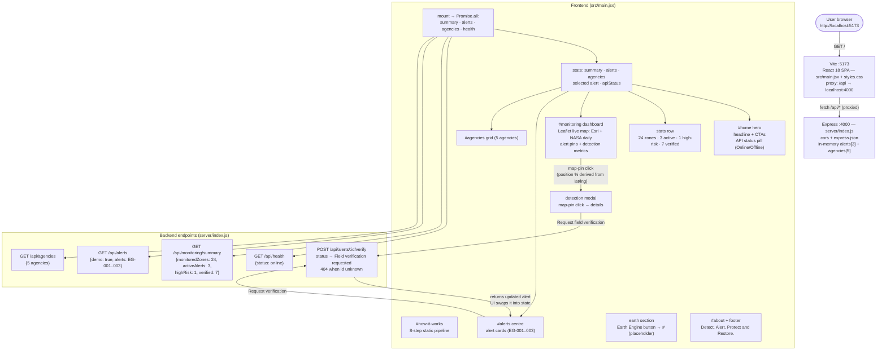
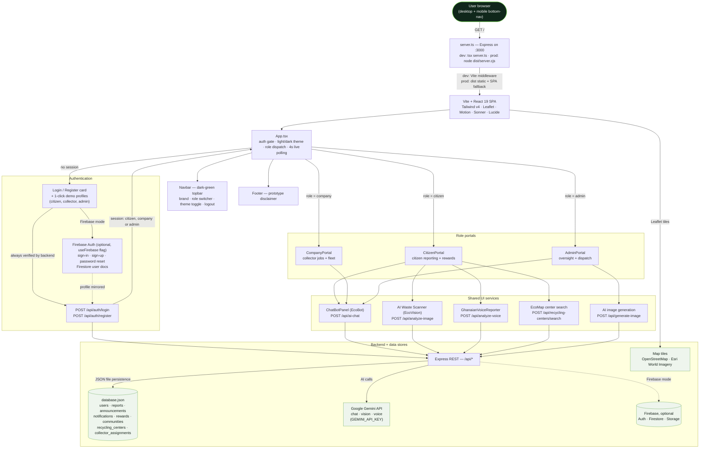
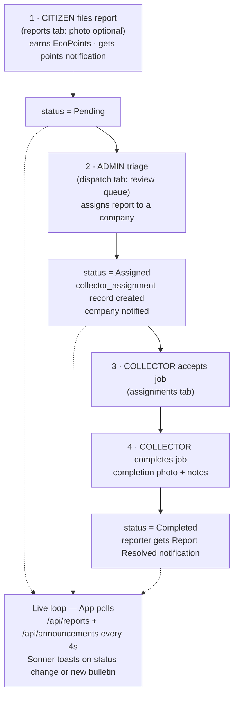
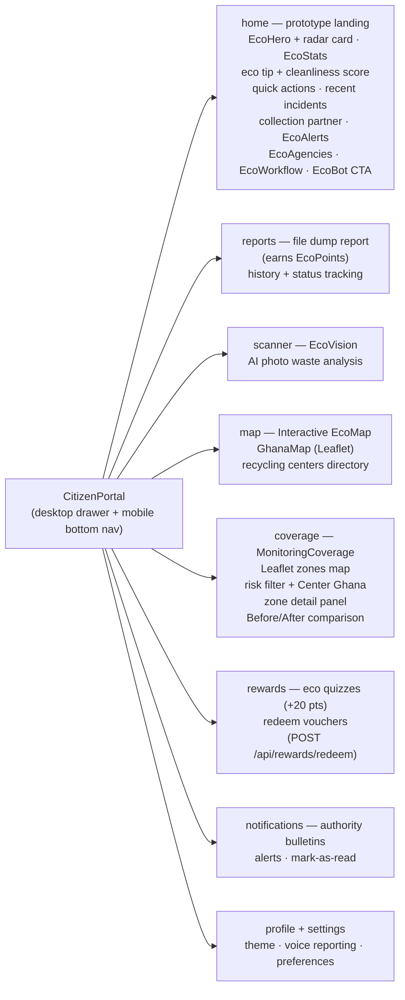
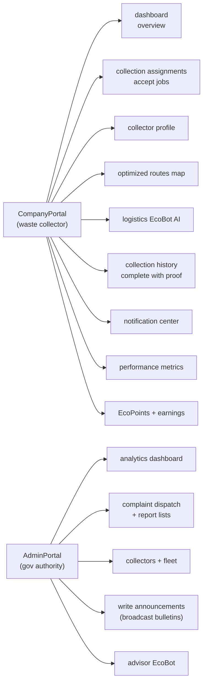

# EcoGuard Ghana — Architecture & Flowcharts

> Rendered automatically on GitHub (mermaid). Paste any diagram into
> https://mermaid.live to view or export it as PNG/SVG.
>
> Scope: Sections 1–2 describe the CURRENT project in this folder
> (EcoGuard-Ghana-React-FullStack, as built — this is the active scope).
> Sections 3–9 describe the full EcoGuardian platform architecture, which is
> mostly RESERVED FOR FUTURE USE (see the Now-vs-Future map in Section 2).

## 1. Current project — as built (active scope)

Stack: React 18 + Vite dev server on `:5173` (proxies `/api` → `:4000`) +
Express backend `server/index.js` on `:4000` with in-memory demo data.
Run: `npm install`, then `npm run dev`, open http://localhost:5173.
Mobile web app: PWA manifest + icons + production-only offline service
worker (`public/`), installable via Add to Home Screen.

## 2. Now vs Future — most appropriate at the moment

Use the left column NOW (already built and verified above). Everything on the
right is RESERVED for later — adopt a row only when its trigger is met.

| Use now (this project) | Reserved for future | Full-arch ref |
| ---------------------- | ------------------- | ------------- |
| Demo alerts (EG-001..003) + verify flips status in memory | Persisted reports with Pending → Assigned → Completed lifecycle + citizen/collector/admin roles | §4 |
| Static 8-step pipeline section | Live satellite ingest + AI change detection + GIS layers | §3 |
| Fake map pins + detection modal | Leaflet maps (OSM/Esri), risk filters, zone detail panels, Before/After comparison | §5 |
| Agencies info grid (static) | Agency accounts + dispatch → accept → complete workflows | §6 |
| Earth Engine button placeholder (`href="#"`) | Wire the public Earth Engine App URL in `src/main.jsx` once the EE project is registered and the app published | README note |
| API status pill (Online/Offline) | 4s live polling + toasts + notification center | §3 |
| Summary stats (24 / 3 / 1 / 7 demo values) | Real aggregates from a database | §7 |
| Single public view, no login | Auth + Citizen / Collector / Gov-Admin portals | §3, §5, §6 |
| — (not present) | EcoPoints, rewards, quizzes, communities | §5 |
| — (not present) | Gemini AI chat / vision / voice, Firebase Auth + Firestore + Storage, voice reporting | §3 |

Recommended slice for the moment: monitoring summary → alerts centre →
request-verification loop, with agencies as supporting info. That is the demo
that works end-to-end today.

## 3. Platform overview — request flow, auth, roles, services

## 4. Report lifecycle — Report → Action → Collection → Completion

## 5. Citizen portal — tab map

## 6. Company + Admin portals — tab map

## 7. REST API reference (full platform)

| Method | Endpoint | Used by |
| ------ | -------- | ------- |
| POST | `/api/auth/login`, `/api/auth/register` | Auth gate, demo profiles (+50 EcoPoints on citizen signup) |
| GET/POST/PUT | `/api/reports`, `/api/reports/:id`, `/api/reports/:id/assign`, `/api/reports/:id/complete` | Citizen filing + tracking, admin dispatch, collector completion |
| GET/POST | `/api/announcements` | Admin publishing, bulletin ribbon, notifications tab |
| GET/POST/PUT | `/api/notifications`, `/api/notifications/:id` | Points / assignment / resolution / bulletin alerts |
| GET/POST | `/api/rewards`, `/api/rewards/redeem` | Rewards tab, quizzes, voucher claims |
| GET/POST | `/api/communities` | Community engagement |
| GET/POST | `/api/recycling_centers`, `/api/recycling-centers/search` | EcoMap directory + AI search |
| GET/POST/PUT | `/api/collector_assignments`, `/api/collector_assignments/:id` | Dispatch → accept → complete chain |
| GET/PUT | `/api/users`, `/api/users/:id`, `/api/companies` | Admin user management, role views |
| POST | `/api/ai-chat`, `/api/analyze-image`, `/api/analyze-voice`, `/api/generate-image` | EcoBot, EcoVision scanner, voice reports, image gen (Gemini) |

## 8. Data entities (full platform: database.json + types.ts)

- **User** — id, name, email, role (citizen/company/admin), ecoPoints
- **Report** — title, description, category, severity, status (Pending → Assigned → Completed), location (lat/lng/address), reporter, points awarded, photos, assignment + completion notes
- **Announcement** — title, content, category (Alert/Event/Update), author
- **Notification** — userId, title, message, type (assignment/resolved/points/announcement/campaign), read flag
- **Reward** — title, points cost, category (vouchers/merchandise/tree-planting)
- **Community** — name, points, rank, members, environmental score, campaigns
- **RecyclingCenter** — name, address, accepted material types
- **CollectorAssignment** — report link, company, status, completed date
- **MonitoringZone** (frontend demo data, `src/data/monitoringCoverage.ts`) — location, region, lat/lng, status (monitoring/change/high-risk), zone type, imagery date, detected change, risk level

## 9. Run commands (full platform — Default Project repo)

| Command | Purpose |
| ------- | ------- |
| `npm run dev` (`tsx server.ts`) | Dev server on http://localhost:3000 (Express + Vite middleware) |
| `npm run build` | Production build → `dist/` (Vite bundle + `dist/server.cjs`) |
| `npm run start` | Serve production build |
| `npm run lint` (`tsc --noEmit`) | Type-check |
